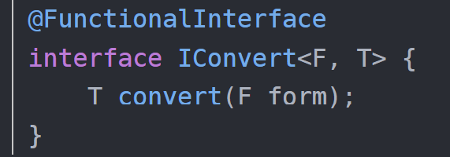
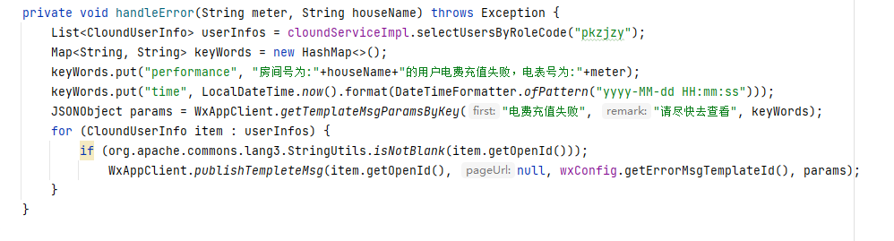

使用::来访问到类的构造方法，对象方法，静态方法。需要一个函数式接口来接收

@FunctionalInterface 在接口上使用这个注解来标注函数式接口（只能包含一个抽象方法）



这个函数式接口F为参数 T为返回值

lambda表达式可以引用局部变量和类成员

filter return true保留 false的过滤

判断值是否为空时，可以使用StringUtils的isEmpty（）判断字符串是否为空， isNotBlank（str）   **判断某字符串是否不为空且长度不为0且不由空白符(whitespace) 构成**。或者使用Optional可以为Null的容器，可以保存类型为T的值或者是空，使用**isPresent（） **如果值存在会返回true，不存在返回false；或者使用Optional.ofNullable为空创建一个空对象；判断list的时候使用isEmpty()方法 为null则是true 适当加！

LocalDateTime.now().format(DateTimeFormatter.ofPattern("yyyy-MM-dd HH:mm:ss")) 格式化时间

```java
 if (!list.isEmpty()){
            Collections.sort(list, new Comparator<ApplyCustomer>() {
                @Override
                public int compare(ApplyCustomer o1, ApplyCustomer o2) {
                    LocalDateTime date1 = o1.getApplyDt();
                    LocalDateTime date2 = o2.getApplyDt();
                    if (date1.isBefore(date2)){
                        // 详见方法解释
                        // 2022-05-12 修改return 1 为 -1
                        return -1;
                    }else {
                        return 1;
                    }
                }
            });
            if (StringUtils.isNotBlank(list.get(0).getWorkUnit())){
                result.setWorkUnit(list.get(0).getWorkUnit());
            }
```

循环list比较LocalDateTime 时间小的在后面

SpringData MongoDB操作

```java
public List<MeterRechargeFailRecord> findUsersPage(@RequestBody PageMeterRechargeFailRecord queryPage) {
   Integer page = queryPage.getPageNum();
   Integer size = queryPage.getPageSize();
   // 拿到查询条件
   MeterRechargeFailRecordVO meterRechargeFailRecordVO = queryPage.getMeterRechargeFailRecordVO();
   MeterRechargeFailRecord con = new MeterRechargeFailRecord();
   BeanUtils.copyProperties(meterRechargeFailRecordVO,con);
   // 创建查询对象
   Query query = new Query();
   Criteria criteria = new Criteria();
   // 设置查询条件
    // 准确查询
   if (!StringUtils.isEmpty(meterRechargeFailRecordVO.getIfSuccess())){
      criteria.and("ifSuccess").is(con.getIfSuccess());
   }
    // 全模糊查询
   if (!StringUtils.isEmpty(meterRechargeFailRecordVO.getCustomerId())){
      Pattern pattern = Pattern.compile("^.*" + con.getCustomerId() + ".*$");
      criteria.and("customerId").regex(pattern);
   }
    //后模糊查询
   if (!StringUtils.isEmpty(meterRechargeFailRecordVO.getHouseName())){
      Pattern pattern = Pattern.compile("^" + con.getHouseName() + ".*$");
      criteria.and("houseName").regex(pattern);
   }
   if (!StringUtils.isEmpty(meterRechargeFailRecordVO.getStart()) && !StringUtils.isEmpty(meterRechargeFailRecordVO.getEnd())){
      criteria.and("createDt").gte(meterRechargeFailRecordVO.getStart()).lte(meterRechargeFailRecordVO.getEnd());
   }
   query.addCriteria(criteria);
   //排序
   Sort sort = Sort.by(Sort.Direction.DESC, "createDt");
   query.with(sort);
   //这个分页要从0开始
   PageRequest pageable = PageRequest.of(page, size, sort);
   //查询数据
   List<MeterRechargeFailRecord> list = meterRechargeFailRecordServiceImpl.find(query.with(pageable));
   // 查询全部之后返回分页数据
   long count = messageLogService.count(query);
   PageableExecutionUtils.getPage(messageLogs,pageable,()-> count);
}
```

mongDB模糊查询



调用微信号推送信息，在charge\collect\web\FcMeterController.java

```Plain Text
feeMap1.getTaxrate().compareTo(new BigDecimal(0)) > 0)
```

使用BigDecimal判断是否为0时候使用上面的方法

Stream是数据流，Stream的操作符分为两种，中间操作符和终止符。对于中间操作符来说，中间操作过一次了还继续流动到下一个中间操作符哪里，直到运行到终止操作符。

中间操作符有：

- map(mapToInt,mapToLong,mapToDouble) 转换 操作符，把比如（lambda）A->B，这里默认提供了转int，long，double的操作符。
- flatmap(flatmapToInt,flatmapToLong,flatmapToDouble) 拍平操作比如把 int[]{2,3,4} 拍平 变成 2，3，4 也就是从原来的一个数据变成了3个数据，这里默认提供了拍平成int,long,double的操作符。
- limit 限流操作，比如数据流中有10个 我只要出前3个就可以使用。
- distint 去重操作，对重复元素去重，底层使用了equals方法。
- filter 过滤操作，把不想要的数据过滤。
- peek 挑出操作，如果想对数据进行某些操作，如：读取、编辑修改等。
- skip 跳过操作，跳过某些元素。
- sorted(unordered) 排序操作，对元素排序，前提是实现Comparable接口，当然也可以自定义比较器。

终止操作符有：

- collect 收集操作，将所有数据收集起来，这个操作非常重要，官方的提供的Collectors 提供了非常多收集器，可以说Stream 的核心在于Collectors。
- count 统计操作，统计最终的数据个数。
- findFirst、findAny 查找操作，查找第一个、查找任何一个 返回的类型为Optional。
- noneMatch、allMatch、anyMatch 匹配操作，数据流中是否存在符合条件的元素 返回值为bool 值。
- min、max 最值操作，需要自定义比较器，返回数据流中最大最小的值。
- reduce 规约操作，将整个数据流的值规约为一个值，count、min、max底层就是使用reduce。
- forEach、forEachOrdered 遍历操作，这里就是对最终的数据进行消费了。
- toArray 数组操作，将数据流的元素转换成数组。

例子

```java
  public static void main(String[] args) {
        Stream.of("apple","banana","orange","waltermaleon","grape")
                .map(e->e.length()) //把数据转为单词的长度 int 
                .forEach(e->System.out.println(e)); //循环输出
    }
```

对于查询条件有些需要单模糊有些是全模糊，需要分清楚

在继承service时，需要自己传递一个mapper以后，才可以mapper里的方法

在使用Feign调用远程方法时，在使用方写全Mapper，在提供方去掉类的Mapper，只用写方法的Mapper

Mybatis写Sql的时候 如果某字段一直为空其他都能正常使用，可以写一个resultMap来映射返回的字段。

动态Sql的foreach里 item是每次循环使用的名字，collection是在接口@Param定义的变量

`         <foreach item="item" index="index" collection="houses" `

`                  open="(" separator="," close=")"> `

使用 ScheduledExecutorService类替代Timer来创建定时任务

```java
// 创建线程池接受一下 
ScheduledExecutorService executor = Executors.newScheduledThreadPool(1);
    executor.scheduleAtFixedRate(
            // 执行的线程
            new TimerTask() {
                @Override
                public void run() {
                    System.out.println("-------设定要指定任务--------");
                }
            } ,
            // 延迟多久执行
            0,
            // 执行间隔
            1,
            // 执行时间单位
            TimeUnit.MINUTES);
}
```

也可以使用这个注解来进行定时任务(服务器启动时自动启动) [详情可以查看该地址](https://blog.csdn.net/qq_27256783/article/details/98478371?utm_term=Scheduled%E6%8A%A5%E9%94%99&utm_medium=distribute.pc_aggpage_search_result.none-task-blog-2~all~sobaiduweb~default-2-98478371&spm=3001.4430) 或者 [该地址](https://blog.csdn.net/qq_27256783/article/details/98478371?utm_term=Scheduled%E6%8A%A5%E9%94%99&utm_medium=distribute.pc_aggpage_search_result.none-task-blog-2~all~sobaiduweb~default-2-98478371&spm=3001.4430)

```java
// 前提该类需要加@Component被注册 并且cron只需要写6位 第7位是表示年可以不需要写 
@Scheduled(cron = "0/10 * * * * ?")
```

byte数组与MultipartFile相互转化

```java
 <dependency>
   <groupId>org.springframework</groupId>
   <artifactId>spring-test</artifactId>
   <version>RELEASE</version>
 </dependency>

byte[] testFile = new byte[1024];
InputStream inputStream = new ByteArrayInputStream(testFile);
MultipartFile file = new MockMultipartFile(ContentType.APPLICATION_OCTET_STREAM.toString(), inputStream);
// 注意这里的MultipartFile 和 MockMultipartFile 
```

自动获取指定时间的毫秒数

```Plain Text
/**
 * 获取指定时间对应的毫秒数
 * @param time "HH:mm:ss"
 * @return
 */
public static long getTimeMillis(String time) {
    try {
        DateFormat dateFormat = new SimpleDateFormat("yy-MM-dd HH:mm:ss");
        DateFormat dayFormat = new SimpleDateFormat("yy-MM-dd");
        Date curDate = dateFormat.parse(dayFormat.format(new Date()) + " " + time);
        return curDate.getTime();
    } catch (ParseException e) {
        e.printStackTrace();
    }
    return 0;
}
```

在进行判断时取数组的size＜1 或 ＞0 的

写在service层的sql在每行的后面记得加上空格 要不然会和下一行连在一起

```Plain Text
@Select("SELECT id,customer_id customerId, customer_name customerName,customer_phone customerPhone,customer_type customerType,sex,cert_type certType,cert_number certNumber,census,house_use_property houseUseProperty,customer_age_stage customerAgeStage,pet,apply_dt applyDt,house_id houseId,house_name houseName,build_id buildId,build_name buildName,project_id projectId,project_name projectName,audit_state auditState,audit_dt auditDt," +
        "refuse_reason refuseReason,client_app_id clientAppId,tenant_id tenantId,audit_user_id auditUserId,audit_user_name auditUserName ,lease_start_date leaseStartDate ,lease_end_date leaseEndDate,work_unit workUnit " +
        "FROM apply_customer " +
        "where customer_id=#{customerId} and tenant_id=#{tenantId} and house_id = #{houseId} and project_id=#{projectId} " +
        "ORDER BY audit_dt "+
        "DESC LIMIT 1"
)
```

对于mybatis里需要检验参数是否一致时可以在test中写 xx == 'xx' 进行字符判断

接受JSON格式的日期时可以在字段上加上下列注解格式化日期

```Plain Text
@JsonFormat(pattern = "yyyy-MM-dd")
```

FastJson转换

```Plain Text
// 转换为普通数组
JSON.parseArray(assetValue).toJavaList(String.class);
// 转换为对象数组
JSON.parseObject(assetResultMap.get("data").toString()).getJSONArray("dataList").toJavaList(AssetVO.class);

接受JSOn参数的时候可以加上这个注解
  @JSONField(name = "")
如果json传过来的是一个对象 可以在类的上面加上该注解
   @JSONType(includes = {"id,name,orderNo"})
    public static class userOrRole{
        @JSONField(name = "id")
        private Long id;
        @JSONField(name = "name")
        private String name;
        @JSONField(name = "orderNo")
        private Integer orderNo;
    }
!!! 注意内部类一定需要写static修饰 要不然会报错


```

使用contains（）判断的时候注意Long和String会一直为false

```Plain Text

.filter(item -> !redisAssetVOList.contains(item.getId().toString()))
```

将long类型转换为string类型 防止前端接受后精度丢失

```Plain Text


SerializeConfig serializeConfig = new SerializeConfig();
serializeConfig.put(Long.class, ToStringSerializer.instance);
serializeConfig.put(Long.TYPE, ToStringSerializer.instance);
//一定要设置SerializerFeature.PrettyFormat
String json = JSONObject
        .toJSONString(byId, serializeConfig,
                SerializerFeature.PrettyFormat);
```
