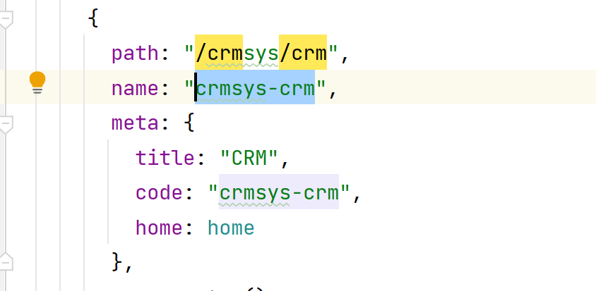
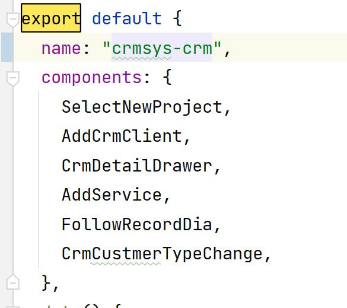

1.自定义组件把整个页面都变成了组件；element UI 会把组件和router里名称一样的自动进行缓存，相当于加入了<keep-alive >标签





2.如果element UI抽屉点击遮罩无法回退 可以查看组件的wrapperClosable的属性是否被设置为了false 


3.JSHint: 'export' is only available in ES6 (use 'esversion: 6').(W119) 报这个错误

在页面上加上 /\* jshint esversion: 6 \*/ 就好了 或者在settings搜索JSHint 关闭就可以了


4.console.log(data,"名称") 可以增加备注名称


```javascript
let urlData = base + url;
if (base.endsWith("/") && url.startsWith("decorate")) {
  urlData = "http://localhost:26260/" + url.substring(9)
} else if (base.endsWith("/") && url.startsWith("decorate")) {
  urlData = base + url.substring(1);
} else if (!base.endsWith("/") && !url.startsWith("/")) {
  urlData = base + "/" + url;
}
```
5.请求上加上这个拦截 然后把环境切换成一致的dev


6.关于抽屉遮罩点开一次后续无法打开可能是因为遮罩未关闭没有设置before-close方式 使用：before-close绑定方法正确关闭就可以了


7.使用.\$emit（方法名）可以调用到父组件的方法 使用\$refs方法可以调用到子组件的方法


8.可以在vue中创建FormData的实例 使用let 名称 = new FormData；


9.@/ 表示表示Src目录 


10.Vue注册组件的时候需要倒入组件路径，把组件名称写入components里，然后写组件，同时注意组件的位置不是随便放的，需要放入html代码块中

```javascript
<setMapper :computedFeeOptions="setManager"></setMapper>

<script>
import setMapper from "./components/setMapper";
export default {
  name: "meterRecharge-index",
  components:{
    setMapper
  },
```


11.select框是空白不是没有数据查看复制层级对的上吗


12.对于组件请求时传递的数据，请求完成之后记得清除传递的数据（包括组件的信息），以及更新关闭抽屉和组件的显示判断条件


13.发送的请求如果后端一直接收不到，查看使用的注解是否正确，requestBody或者param，如果还是没接收到参数，查看是否转为Json格式了


14.关于时间选择组件 需要设置默认时间   ` :default-time="['00:00:00', '23:59:59']"`

     

15.使用下拉框想要传递多个参数时 可以在组件上增加   `@change="getserviceManager($event)"`

  `  getserviceManager(event){`

`      let choosenItem = this.serviceManagerAll.filter((item) => item.id === event)[0];`

`      this.basicData.serviceManagerId = choosenItem.id`

`      this.basicData.serviceManagerName = choosenItem.realName`

`    },`


16.html页面显示字段的时候可以写一个默认值                     

`{{ detailContractData.serviceManagerName || "暂无" }}`


17.前端给后端发送请求带参数的时候，切记要把ID类的默认值变成''确保后几位的精确度，以及String类型的参数最后设置为NUll ，因为'' 在发给保存到数据库的时候是可以保存上的，与null值不一样


18.对于分页查询的页面 需要注意第一页的数据发请求的时候是第几页，以及返回时是第几页的页数


19.使用抽屉时如果在一个组件的内部放另一个组件 点开时会置于遮罩下面 

解决方法： 

```javascript
添加这个属性
:append-to-body='true'
或者 
在组件作用域之外写
```


20.想让方法同步执行需要在方法前面加上 async关键字


21.对于watch第一次监听不生效 可在watch下 加入以下关键字

```javascript
watch: {
    id: {
      immediate: true, // immediate选项可以开启首次赋值监听 ！！
      async handler(newVal,oldVal) {
      	console.log(newVal);
      	console.log(oldVal);
      	console.log('我发生了变化');
      },
    },
  },

```


22.使用路由跳转的时候可以在连接后写入参数 详见 [这里哦](https://blog.csdn.net/m0_49661870/article/details/121489024)

```javascript
this.$router.push({name:'houseChoose',params:event});
name 为跳转路径不需要写/ , params写参数
栗子：
 this.$router.push({ name: 'home', query: { id: '1' } })
      this.$router.push({ path: '/home', query: { id: '1' } })
      // html 取参 $route.query.id
      // script 取参 this.$route.query.id

```


23.table表格数据不刷新可以使用

```javascript
this.dataList.splice(1,0);
or
vue.$set() 
set的正确写法
 this.$set(this.options[1],"disabled",true) 
第一个参数为参数所在范围，第二个为参数名称（记得加双引号），第三个为写入的值
```


24.elementUI文件上传组件 缩略图不显示跟url属性有关 请查看是否url属性有值


25\.  可以在标签上加入键盘监听事件 @keydown [详见](https://blog.csdn.net/qq_45067263/article/details/124249828) 

**注意**：在element组件标签上使用键盘事件的时候，需要在事件后面加上.native才能够使用，如下

@keydown.enter.native="submitForm('ruleForm')"

在element组件内部或者外部使用键盘事件的时候，正常使用就好了，如下

@keydown.enter="submitForm('ruleForm')"


26\. 对于回显选择框解决方法

```javascript
多选框返回的数组可以可以通过split拆分为数组 回显错误可以加上... 这个是因为格式错误导致的 可以使用type of 查看返回数据格式
this.contractTypeId.push(...row.contractTypeId.split(",")||null);

```


